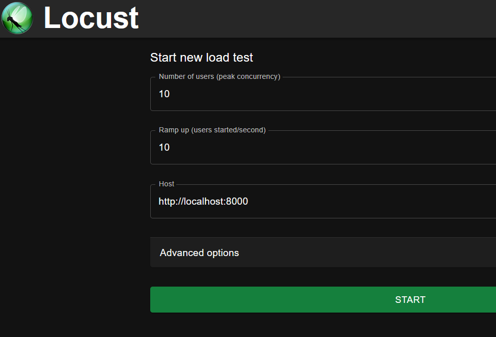
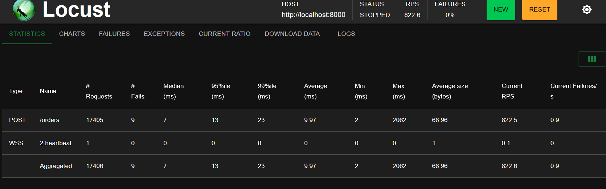

# try-websocket

## Features

- Fast api built with websocket receiver under /frontend path
- Unit tests
- static code analysis and formaters (black, isort, mypy, pylint, ruff)
- poetry
- Github actions basic setup
- performance tests in locust
- e2e tests using request


## How to run

#### Docker

- Build image and run
```shell
TBD
```

```shell
TBD
```

#### Without docker
- API
```shell
poetry install
```

```shell
poetry run fastapi dev ./src/traiding_app/main.py
```
Then go to localhost/docs and localhost/frontend for ws order visualisation.

- Unit-tests:

```shell
poetry run pytest
```
- e2e-tests (api must be running):
```shell
cd ./e2e_and_performance
poetry run pytest e2e.py
```

- locust (api must be running):
```shell
cd ./e2e_and_performance
poetry run locust
```
go to http://localhost:8089 
Setup your test with users as desired (one user is reserved for ws):


 Results:
